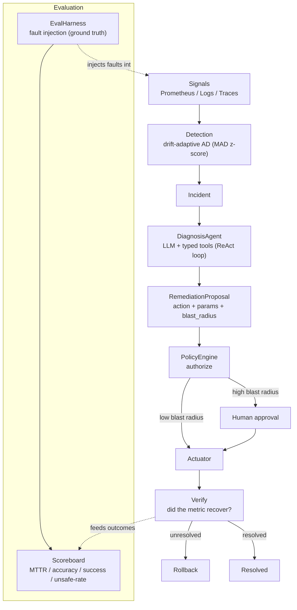

# IncidentPilot

**An agentic SRE that hovers over your services, watches for trouble, and strikes only when it's authorized to.**

> Pilots an incident from detection to fix — a copilot for on-call.

IncidentPilot watches running services, detects incidents with drift-adaptive anomaly detection, root-causes them from metrics/logs/traces via an LLM tool-calling loop, and remediates **behind an authorization policy + human approval** — all orchestrated by a **durable workflow** so it survives crashes and is fully auditable. Ground truth for evaluation comes from a **fault-injection harness**.

---

## Why this isn't slop

Most "AI for ops" demos are log summarizers: they paste logs into an LLM and print a paragraph. IncidentPilot is built around the two things that actually make an SRE agent trustworthy:

1. **Authorized action, not narration.** The agent proposes a *typed* remediation; a code-level `PolicyEngine` decides whether it's allowed, and any high-blast-radius action requires a human. The LLM never actuates anything directly — the `Actuator` is the only thing that can, and it refuses unless policy + mode + approval all say yes.
2. **Measured correctness, not vibes.** A fault-injection harness gives us **ground truth**. We score MTTR, root-cause accuracy, remediation success rate, and — most importantly — an **unsafe-action rate** we drive to zero. If it can't be measured against injected faults, it doesn't ship.

Everything durable runs on Postgres via **DBOS** (no new infra), and the default LLM is **Groq's free tier** through an OpenAI-compatible client (Claude as a drop-in alternative). Cost-conscious by design.

---

## Architecture



### The four layers

1. **Detection** (`incidentpilot/detection.py`) — a `DriftAdaptiveDetector` keeps a rolling window per metric and flags samples with a robust (median + MAD) z-score. The fixed-length window lets the baseline follow slow drift, so we alert on genuine breaks, not on the trend. *(Reuses the anomaly-detection idea from the owner's StockStream project.)*
2. **Diagnosis** (`incidentpilot/agent.py` + `incidentpilot/signals.py`) — a `DiagnosisAgent` runs a ReAct-style tool-calling loop over an OpenAI-compatible model. Its tools are *typed*: `query_metrics`, `query_logs`, `get_traces`, `recent_deploys`, `read_runbook`. It returns a structured `RootCauseHypothesis` with evidence and confidence.
3. **Remediation + Policy** (`incidentpilot/actions.py`) — the crux. A `RemediationRegistry` maps each `ActionType` to an executor and a default blast radius; the `PolicyEngine` enforces env allowlist, per-action rate limits, and the blast-radius approval gate; the `Actuator` is the only component that touches infra and refuses in `propose_only` mode or without authorization/approval.
4. **Durable orchestration** (`incidentpilot/workflow.py`) — a DBOS workflow drives diagnose → propose → authorize → (await approval) → act → verify → rollback. Each step checkpoints to Postgres, so a crash or redeploy resumes from the last completed step with exactly-once side effects.

Plus an **evaluation** layer (`eval/harness.py`) that injects known faults and scores the whole loop.

---

## Quickstart

```bash
# 1. Environment
python -m venv .venv && source .venv/bin/activate
pip install -e ".[dev]"
cp .env.example .env            # add GROQ_API_KEY

# 2. Durable state (Postgres only — reuse your existing Prometheus/Grafana)
docker compose up -d

# 3. Run the API (webhook + approvals + scoreboard)
incidentpilot                          # -> http://localhost:8000

# 4. Run the evaluation harness (fault injection -> scoreboard)
python -m eval.harness

# tests + lint
pytest -q
ruff check .
```

IncidentPilot reuses the owner's **existing Prometheus/Grafana** for signals, **StockStream's** drift-adaptive anomaly-detection idea for detection, and **Falcon's k6 / failure scripts** as the fault source for the eval harness.

---

## Interview story

> "I built an agentic SRE that closes the loop from detection to remediation, but the interesting engineering is everything I did to make it *safe* and *measurable*. The LLM can only ever produce a **typed proposal**; a code-level policy engine decides if it's allowed, and anything with a high blast radius needs a human. The whole incident runs as a **durable DBOS workflow on Postgres**, so if the process dies while a payments-service restart is half-done, it resumes exactly-once instead of double-firing. And I don't trust it on vibes — a **fault-injection harness** gives me ground truth, so I can report root-cause accuracy and an unsafe-action rate I keep at zero. It reuses infra I already run: Prometheus/Grafana, an anomaly-detection idea from StockStream, and k6 failure scripts from Falcon."

### Likely follow-ups

**Q: How do you stop the LLM from doing something catastrophic?**
A: The LLM never actuates. It emits a `RemediationProposal` (a closed `ActionType` enum + params + a blast-radius estimate). The `PolicyEngine` — plain code, no model in the loop — enforces an environment allowlist, per-action rate limits, and a blast-radius threshold above which the action *requires human approval*. The `Actuator` refuses to run unless mode is `auto`, the decision is `allowed`, and approval (when required) is present. Default mode is `propose_only`, which never touches infra at all.

**Q: What happens if the agent crashes mid-remediation?**
A: The workflow is a DBOS durable workflow. Every step (diagnose, act, verify…) checkpoints its result to Postgres. On restart, DBOS replays the workflow but skips completed steps, so side effects are exactly-once. The human-approval wait is durable too: the process can redeploy while parked on `DBOS.recv()` and still be waiting on resume.

**Q: How do you know it actually works — that it's not just plausible text?**
A: The eval harness injects a *known* fault (latency spike, worker crash, Redis down) with a `ground_truth_root_cause` and an `expected_remediation`, then scores the run: MTTR, root-cause accuracy (diagnosis vs. ground truth), remediation success rate (did the metric recover), and unsafe-action rate (did we ever execute something unauthorized). That last one is the real product metric.

---

## Roadmap

**MVP (this scaffold)**
- [x] Typed domain models + config
- [x] Drift-adaptive detector (robust z-score)
- [x] Policy engine + actuator with safety guards (the crux)
- [x] Eval scoreboard math + fault library
- [ ] Wire the LLM `_chat()` to Groq and parse tool calls end-to-end
- [ ] Launch DBOS in `main()` and start the workflow from the webhook

**Next**
- [ ] Real signal backends (Loki logs, Tempo/Jaeger traces, deploy API)
- [ ] Real executors (k8s restart/scale, deploy rollback, LB failover)
- [ ] Post-action verification against the incident's own metric
- [ ] Persist incidents/decisions to Postgres; audit log per action

**Stretch**
- [ ] Approval + notifications via Slack, with a one-click approve
- [ ] Blast-radius *learned* from historical impact, not hand-set defaults
- [ ] Multi-service correlation (one root cause, many alerts)
- [ ] Canary remediation with automatic rollback on regression
- [ ] Grafana panel for the live scoreboard
