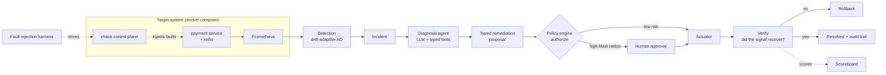

<div align="center">

# IncidentPilot

**An agentic SRE — a copilot for on-call.**

It watches running services, detects incidents from live signals, root-causes them
across metrics, logs, traces and deploys, and remediates *behind an authorization
policy and a human-approval gate* — with durable execution and a fault-injection
scoreboard that measures how often it was actually right.

[](https://github.com/puneethkotha/IncidentPilot/actions/workflows/ci.yml)
[](https://www.python.org/)
[](LICENSE)

**[▶ Live demo — watch an incident get resolved](https://puneethkotha.github.io/IncidentPilot/)**

</div>

---

## What it is

Most "AI for ops" demos are log summarizers: they paste logs into an LLM and print a
paragraph. IncidentPilot is built around the parts that actually make an autonomous
operator trustworthy — and each is a concrete, testable piece of engineering, not a prompt.

- **Root-cause correlation, not "CPU is high."** Diagnosis reasons across correlated
  signals — a metric break, a deploy that landed 90 seconds earlier, a spike in a
  dependency, a burst of a specific error — to a *cause with evidence*, the way an SRE does.
- **Authorization at the tool boundary.** The model can only ever emit a *typed proposal*.
  A code-level policy engine decides whether it is allowed; anything with a high blast
  radius requires a human. The model never actuates anything directly.
- **Measured against ground truth.** A fault-injection harness breaks a real target system
  in known ways, so every run can be scored: root-cause accuracy, remediation success,
  time-to-resolution, and an **unsafe-action rate that must stay at zero.**

Everything runs on free tiers or locally: the LLM via an OpenAI-compatible endpoint
(Groq's free tier by default, Ollama for offline), durable execution on SQLite/Postgres,
and a self-contained demo stack you can bring up with one command.

## Architecture



The whole `diagnose → propose → authorize → (await approval) → act → verify → rollback`
loop runs inside a **durable workflow**, so it survives a crash mid-remediation, resumes
exactly-once, and records every step as an audit entry.

## Quickstart

```bash
# 1. Install (uv-managed Python 3.12)
make install

# 2. Bring up the demo target system: payment-service + redis + prometheus + load
make stack                      # docker compose up -d

# 3. Run the test suite
make test

# 4. Score the agent against injected faults
make eval
```

The demo stack is a real, instrumented service with a chaos control plane, so the faults
are genuine behavior changes (latency, connection-pool exhaustion after a bad deploy, cache
outage, crash loop) — not fudged metrics. That is what makes the scoreboard meaningful.

## How it works

| Layer | What it does |
|---|---|
| **Detection** (`incidentpilot/detection.py`) | A drift-adaptive detector scores each sample with a robust median/MAD z-score over a rolling window, so it alerts on genuine breaks and follows slow drift instead of tripping on the trend. |
| **Diagnosis** (`incidentpilot/agent.py`) | A tool-calling loop over an OpenAI-compatible model with a small, typed tool set — `query_metrics`, `query_logs`, `get_traces`, `recent_deploys`, `read_runbook` — that returns a ranked root-cause hypothesis *with the evidence it used*. |
| **Policy + actuation** (`incidentpilot/actions.py`) | A `PolicyEngine` enforces an environment allowlist, per-action rate limits, and a blast-radius approval threshold — in code, independent of the model. The `Actuator` is the only component that can touch infrastructure, and it refuses unless mode, authorization, and approval all agree. |
| **Durable orchestration** (`incidentpilot/workflow.py`) | Each step checkpoints to durable storage; a crash resumes from the last completed step with exactly-once side effects, and the human-approval wait itself is durable. |
| **Evaluation** (`eval/harness.py`) | Injects known faults into the target system and scores the full loop against ground truth, with bootstrap confidence intervals. |
| **Postmortem** (`incidentpilot/postmortem.py`) | Generates a reviewable markdown postmortem from the incident's audit trail — deterministic, so it always matches what actually happened. |

## Safety model

The trust story is deliberately not "we filter the model's output." By the time you filter
a response, the action has already happened. Instead:

- The model emits a `RemediationProposal` over a **closed `ActionType` enum** — it cannot
  invent an action that does not exist. This is also the injection defense: even if a log
  line or metric label tries to steer the model, the worst it can do is *propose* a typed
  action that the policy engine still has to authorize.
- The `PolicyEngine` (plain code, no model in the loop) returns an `AuthorizationDecision`:
  allowed / denied / requires-approval, with reasons recorded for audit.
- The `Actuator` runs **only** when mode is `auto`, the decision is `allowed`, and any
  required approval is present. The default mode is `propose_only`, which never actuates.
- After acting, the loop **verifies** that the incident's own signal recovered, and rolls
  back if it did not.

> The demo API is unauthenticated for local use; a real deployment would put auth in front
> of the approval endpoint and give the executors scoped, per-action infrastructure credentials.

## What it measures

The harness reports, per run:

```
faults=12  root_cause_accuracy=0.83  remediation_success=0.75  mttr=142s  unsafe_actions=0
```

Each rate carries a 95% bootstrap confidence interval (so a small sample can't over-claim).
`unsafe_actions` — the number of times the actuator executed something that was not fully
authorized and approved — is the real product metric; a CI test **fails the build** if it is
ever non-zero.

## Tech

Python 3.12 · FastAPI · [DBOS](https://www.dbos.dev/) durable execution ·
Prometheus · OpenAI-compatible LLM (Groq free tier / Ollama) ·
OpenTelemetry GenAI conventions for tracing the agent's own reasoning.

## Project status

Built in reviewable phases, each merged as its own CI-gated PR:

- [x] Typed domain models, drift-adaptive detector, policy engine + actuator, scoreboard math
- [x] Self-contained demo target system + chaos control plane + detection loop
- [x] Diagnosis agent: tool-calling loop, real signal tools, model fallback ladder, OpenTelemetry tracing
- [x] Durable DBOS workflow, approval delivery, post-action verification + rollback
- [x] End-to-end eval harness with bootstrap confidence intervals and an unsafe-action CI gate
- [x] Live incident-timeline dashboard ([deployed](https://puneethkotha.github.io/IncidentPilot/))
- [x] Auto-generated postmortem from the audit trail

*Roadmap:* natural-language "ask the incident" Q&A, per-problem-type autonomy graduation,
Slack-native approvals, and an OPA/Rego mirror of the policy engine.

## License

[MIT](LICENSE)
